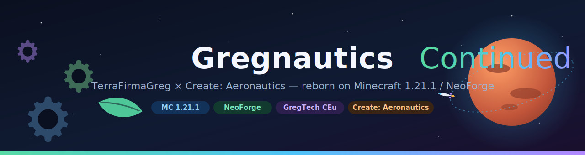
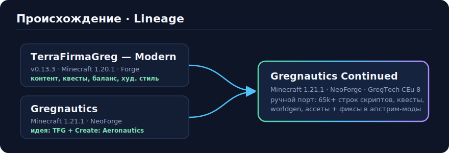
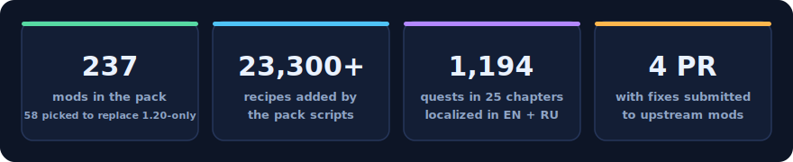
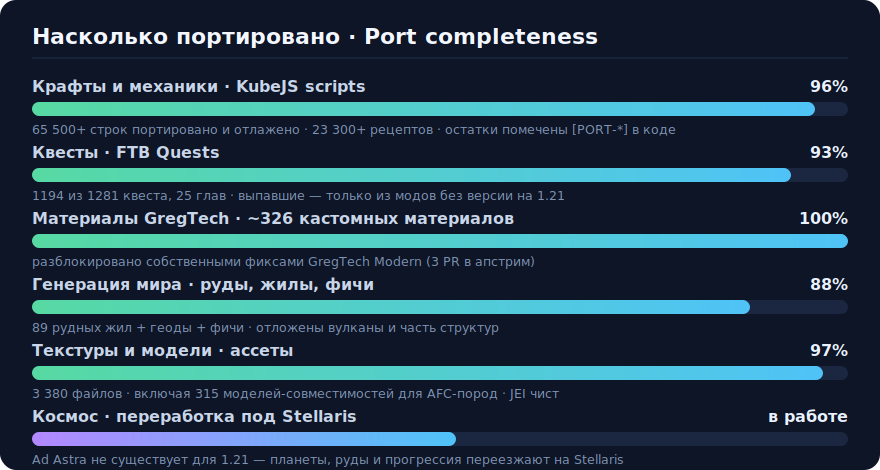

<p align="center">
  
</p>

<p align="right"><b>🇬🇧 English</b> · <a href="README.ru.md">🇷🇺 Русский</a></p>

<p align="center">
  <a href="#-installation"></a>
  <a href="#-installation"></a>
  
  
  
</p>

<h3 align="center">Stone-age survival → GregTech industry → flying ships → other planets.<br>The legendary TerraFirmaGreg — on modern Minecraft for the first time.</h3>

---

## 🌍 What is this

**Gregnautics Continued** is a hand-made port of the **TerraFirmaGreg — Modern** modpack (1.20.1) to **Minecraft 1.21.1 / NeoForge**, integrated with **Create: Aeronautics** — the mod that lets you build flying ships out of Create machinery and travel on them.

This is not a "re-release with newer mod versions" — it is a port of **65,000+ lines** of scripts, 1,200 quests, worldgen, assets and mechanics, adapted by hand to the new APIs. Everything that could not be carried over directly (mods that stayed on 1.20) received carefully chosen replacements.

<p align="center">
  
</p>

## ✨ The player's journey

| Era | What awaits you |
|---|---|
| 🪨 **Stone Age** | Realistic TerraFirmaCraft survival: seasons, thirst, body temperature, hand forging |
| ⚙️ **Metallurgy** | Anvils, alloys, blast furnaces — the road from copper to steel through real metallurgy |
| 🏭 **Industrialization** | GregTech CEu Modern: voltage ages ULV → UHV, automation, chemistry, cleanrooms |
| 🚢 **Aeronautics** | Create: Aeronautics — build your own flying ship out of rotating machinery |
| 🚀 **Space** | Stellaris: rockets, the Moon, Mars, Venus and beyond — for late-game resources |

<p align="center">
  
</p>

## 📊 Port completeness

The port was done in phases (P0–P10) with continuous verification on a dedicated test server — every iteration was driven to "CLEAN: 0 errors, 0 broken recipes".

<p align="center">
  
</p>

<details>
<summary><b>What "porting" actually meant (click)</b></summary>

Between 1.20.1/Forge and 1.21.1/NeoForge, practically everything changed:

- **KubeJS 6 → 7**: different script scoping, different registration APIs, NBT → data components;
- **GregTech CEu 1.x → 8.0**: the material registry became a vanilla Registry; tags, items and fluids renamed; recipe schemas rewritten;
- **TerraFirmaCraft 3.x → 4.x**: new data codecs (heat, climate, item sizes), new recipe formats;
- **Forge tags → common `c:` conventions** of NeoForge — hundreds of renames;
- the **TFG-Core** mod (the original's core, 1.20-only) — recreated from scratch with scripts and datapacks.

Every deviation from the original is marked in code with `[PORT]` / `[PORT-FIX]` / `[PORT-Ф*]` markers — there are about a thousand of them, and every decision can be traced through them.

The full technical diary of the port (phases, upstream bugs found, hard-won 1.21 API facts) lives in [`docs/PORTING_NOTES.md`](docs/PORTING_NOTES.md) *(in Russian)*.
</details>

## 🔧 Upstream contributions

Along the way, bugs were found and fixed in the mods themselves — the fixes were submitted to the authors:

| Mod | Problem | PR |
|---|---|---|
| GregTech CEu Modern | KubeJS materials with a non-mod namespace lost their block registration (registry crash) | [#5111](https://github.com/GregTechCEu/GregTech-Modern/pull/5111) |
| GregTech CEu Modern | NPE when declaring a research recipe without other conditions | [#5109](https://github.com/GregTechCEu/GregTech-Modern/pull/5109) |
| GregTech CEu Modern | Client crash: JEI runtime accessed during registration | [#5115](https://github.com/GregTechCEu/GregTech-Modern/pull/5115) |
| KubeJS TFC | Leaves builder incompatible with TFC 4.2.4+ (NoSuchMethodError) | [#41](https://github.com/Notenoughmail/KubeJS-TFC/pull/41) |

Until the PRs are merged, the pack ships its own patched builds of these mods (sources are in the pack author's forks; LGPL-3.0 licenses respected).

## 📦 Installation

Pick whichever format suits your launcher — all of them are on the [**Releases**](../../releases) page:

| File | For | How |
|---|---|---|
| `*-curseforge.zip` | CurseForge App, Prism, ATLauncher | Import as a CurseForge pack — missing mods download automatically |
| `*.mrpack` | Modrinth App, Prism Launcher | Import the file — mods download from Modrinth automatically |
| `*-multimc.zip` | MultiMC / Prism (offline) | Import as instance — **everything is bundled**, nothing to download |
| `*-server.zip` | **Dedicated server** | Unpack, run `install.sh` / `install.bat`, accept the EULA, start — client mods stripped |

**Or install straight from a clone of this repository** (everything is committed, mods included):

1. `git clone https://github.com/ascorblack/Gregnautics-Continued.git`
2. Create a **Minecraft 1.21.1 + NeoForge 21.1.235** instance in your launcher.
3. Copy `mods/`, `config/`, `kubejs/`, `defaultconfigs/`, `resourcepacks/`, `shaderpacks/` into the instance folder.
4. Allocate memory and play.

> 🚧 The CurseForge page is awaiting moderation — the link will appear here once approved.

**Requirements**: 8 GB+ of allocated memory (16 recommended), Java 21.

## 🗂 Repository layout

```
mods/              — all 238 mods, incl. the patched GregTech build
server-mods/       — dedicated-server guide (required-on-server mods, tuning)
kubejs/            — pack scripts (startup / server), assets, datapack
  */tfg_port/      — ported TerraFirmaGreg content (all changes marked [PORT])
  server_scripts/gregnautics_*.js — the fork's own integration scripts
config/ftbquests/  — 1,194 quests in 25 chapters
defaultconfigs/    — default server configs
docs/              — porting notes, mod list, asset licenses
```

## ⚠️ Known limitations

- **Space content** is moving from Ad Astra (no 1.21 version exists) to Stellaris — some mechanics are still being reworked;
- AFC-wood carts placed in the world may render untextured (the mod's skin generator doesn't know the new wood types — icons and names are already fixed);
- a few broken recipes in third-party mods (woodencog and others) — bugs of those mods, no gameplay impact.

## 🙏 Credits and attribution

- **[TerraFirmaGreg Team](https://github.com/TerraFirmaGreg-Team)** — for the original TerraFirmaGreg — Modern pack, whose content forms the foundation of this port;
- the author of the original **Gregnautics** — for the idea of marrying TFG with Create: Aeronautics;
- the **TerraFirmaCraft**, **GregTech CEu Modern**, **Create** / **Create: Aeronautics** and **Stellaris** teams — for the mods everything is built around;
- the authors of all 238 mods in the pack.

Licenses of borrowed assets are documented in [`docs/ASSET_LICENSES.md`](docs/ASSET_LICENSES.md) *(in Russian)*.
