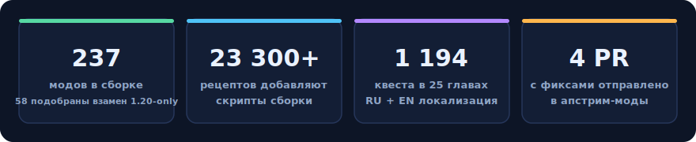

<p align="center">
  
</p>

<p align="right"><a href="README.md">🇬🇧 English</a> · <b>🇷🇺 Русский</b></p>

<p align="center">
  <a href="#-установка"></a>
  <a href="#-установка"></a>
  
  
  
</p>

<h3 align="center">Выживание каменного века → индустрия ГрегТеха → небесные корабли → другие планеты.<br>Легендарный TerraFirmaGreg — впервые на современном Minecraft.</h3>

---

## 🌍 Что это

**Gregnautics Continued** — ручной порт модпака **TerraFirmaGreg — Modern** (1.20.1) на **Minecraft 1.21.1 / NeoForge** с интеграцией **Create: Aeronautics** — мода, позволяющего строить летающие корабли из механизмов Create и путешествовать на них.

Это не «перевыпуск с новыми версиями модов» — это порт **65 000+ строк** скриптов, 1 200 квестов, генерации мира, ассетов и механик, вручную адаптированных под новые API. Всё, что нельзя было перенести напрямую (моды, оставшиеся на 1.20), получило тщательно подобранные замены.

<p align="center">
  
</p>

## ✨ Путь игрока

| Эпоха | Что вас ждёт |
|---|---|
| 🪨 **Каменный век** | Реалистичное выживание TerraFirmaCraft: сезоны, жажда, температура тела, ручная ковка |
| ⚙️ **Металлургия** | Наковальни, сплавы, доменные печи — путь от меди до стали через настоящую металлургию |
| 🏭 **Индустриализация** | GregTech CEu Modern: вольтажные эпохи ULV → UHV, автоматизация, химия, чистые комнаты |
| 🚢 **Воздухоплавание** | Create: Aeronautics — постройте собственный летающий корабль из вращающихся механизмов |
| 🚀 **Космос** | Stellaris: ракеты, Луна, Марс, Венера и дальше — за ресурсами высших эпох |

<p align="center">
  
</p>

## 📊 Прогресс порта

Порт делался фазами (Ф0–Ф10) с непрерывной проверкой на выделенном тестовом сервере — каждая итерация доводилась до «CLEAN: 0 ошибок, 0 битых рецептов».

<p align="center">
  
</p>

<details>
<summary><b>Что именно означало «портировать» (клик)</b></summary>

Между 1.20.1/Forge и 1.21.1/NeoForge поменялось практически всё:

- **KubeJS 6 → 7**: другой скоуп скриптов, другие API регистраций, NBT → data components;
- **GregTech CEu 1.x → 8.0**: реестр материалов стал ванильным Registry, переименованы теги, предметы и жидкости, переписаны схемы рецептов;
- **TerraFirmaCraft 3.x → 4.x**: новые кодеки данных (теплота, климат, размеры предметов), новые форматы рецептов;
- **Forge-теги → общие `c:`-конвенции** NeoForge — сотни переименований;
- мод **TFG-Core** (ядро оригинала, только 1.20) — воссоздан скриптами и датапаками с нуля.

Каждое отступление от оригинала помечено в коде маркерами `[PORT]` / `[PORT-FIX]` / `[PORT-Ф*]` — их около тысячи, и по ним можно проследить каждое решение.

Полный технический дневник порта (фазы, найденные баги апстрима, дорого добытые факты об API 1.21) — в [`docs/PORTING_NOTES.md`](docs/PORTING_NOTES.md).
</details>

## 🔧 Вклад в апстрим

В процессе порта были найдены и исправлены баги в самих модах — исправления отправлены авторам:

| Мод | Проблема | PR |
|---|---|---|
| GregTech CEu Modern | Материалы KubeJS с неймспейсом не-мода теряли регистрацию блоков (краш реестров) | [#5111](https://github.com/GregTechCEu/GregTech-Modern/pull/5111) |
| GregTech CEu Modern | NPE при объявлении research-рецепта без иных условий | [#5109](https://github.com/GregTechCEu/GregTech-Modern/pull/5109) |
| GregTech CEu Modern | Краш клиента: обращение к JEI-runtime во время регистрации | [#5115](https://github.com/GregTechCEu/GregTech-Modern/pull/5115) |
| KubeJS TFC | Билдер листвы несовместим с TFC 4.2.4+ (NoSuchMethodError) | [#41](https://github.com/Notenoughmail/KubeJS-TFC/pull/41) |

До принятия PR сборка использует собственные патченные сборки этих модов (исходники — в форках автора сборки, лицензии LGPL-3.0 соблюдены).

## 📦 Установка

Выбери формат под свой лаунчер — всё лежит на странице [**Releases**](../../releases):

| Файл | Для чего | Как |
|---|---|---|
| `*-curseforge.zip` | CurseForge App, Prism, ATLauncher | Импорт как CurseForge-пак — недостающие моды скачаются сами |
| `*.mrpack` | Modrinth App, Prism Launcher | Импортируй файл — моды скачаются с Modrinth автоматически |
| `*-multimc.zip` | MultiMC / Prism (оффлайн) | Импорт как инстанс — **всё уже внутри**, ничего не качается |
| `*-server.zip` | **Выделенный сервер** | Распакуй, запусти `install.sh` / `install.bat`, прими EULA, стартуй — клиентские моды вырезаны, LuckPerms внутри |

**Или установка прямо из клона репозитория** (в репозитории есть всё, включая моды):

1. `git clone https://github.com/ascorblack/Gregnautics-Continued.git`
2. Создай в лаунчере инстанс **Minecraft 1.21.1 + NeoForge 21.1.235**.
3. Скопируй `mods/`, `config/`, `kubejs/`, `defaultconfigs/`, `resourcepacks/`, `shaderpacks/` в папку инстанса.
4. Выдели память и играй.

> 🚧 Страница на CurseForge проходит модерацию — ссылка появится здесь после одобрения.

**Требования**: 8 ГБ+ выделенной памяти (рекомендуется 16), Java 21.

## 🗂 Структура репозитория

```
mods/              — все 236 модов, включая патченную сборку GregTech
server-mods/       — доп. моды для выделенного сервера (LuckPerms) + гайд по серверу
kubejs/            — скрипты сборки (startup / server), ассеты, датапак
  */tfg_port/      — портированный контент TerraFirmaGreg (все изменения помечены [PORT])
  server_scripts/gregnautics_*.js — собственные скрипты интеграции форка
config/ftbquests/  — 1194 квеста в 25 главах
defaultconfigs/    — серверные конфиги по умолчанию
docs/              — заметки порта, список модов, лицензии ассетов
```

## ⚠️ Известные ограничения

- **Космо-контент** переезжает с Ad Astra (мода нет на 1.21) на Stellaris — часть механик в процессе переработки;
- поставленные в мир повозки AFC-пород могут отображаться без текстур (генератор скинов мода не знает о новых породах — иконки и названия уже исправлены);
- несколько битых рецептов у сторонних модов (woodencog и др.) — ошибки самих модов, на игру не влияют.

## 🙏 Благодарности и атрибуция

- **[TerraFirmaGreg Team](https://github.com/TerraFirmaGreg-Team)** — за оригинальную сборку TerraFirmaGreg — Modern, контент которой лёг в основу порта;
- автор оригинального **Gregnautics** — за идею союза TFG и Create: Aeronautics;
- команды **TerraFirmaCraft**, **GregTech CEu Modern**, **Create** и **Create: Aeronautics**, **Stellaris** — за моды, вокруг которых всё построено;
- авторы всех 236 модов сборки.

Лицензии заимствованных ассетов задокументированы в [`docs/ASSET_LICENSES.md`](docs/ASSET_LICENSES.md).
